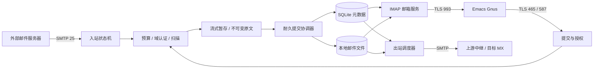

# 架构与 Rust 接口

## 1. 一封邮件经过什么



图表达逻辑关系；实际收 DATA 时先把原文流式写入暂存文件，再由扫描组件从文件读取，最后提交。不能为了符合图的布局把邮件全部装进 `Vec<u8>`。

主服务 `rustymaild` 管理网络、调度和存储；管理工具 `rustymailctl` 通过本地 Unix socket 请求管理动作。MIME/认证解析采用受限工作进程 `rustymail-worker` 隔离不可预测的输入开销；第三方 Rspamd 独立运行。这里是“一个核心服务 + 隔离工作进程”，不是零子进程假设。

主服务只支持单实例写入同一数据目录。启动持有目录锁；第二个实例拒绝启动。CLI 不绕过主服务并发修改数据库，离线修复必须先停止服务。

## 2. 建议的 Cargo workspace

```text
crates/
  core/         标识符、信封、权限上下文、错误类型、配置单位
  protocol/     有界 framing、SMTP/IMAP codec 适配、纯状态转换
  store/        blob 生命周期、SQLite 线程、迁移、配额、恢复
  auth/         Argon2id、应用密码、撤销、授权发件人
  policy/       mail-auth、Rspamd、资源预算、策略结果
  smtp/         25/465/587 服务端会话
  delivery/     SMTP 客户端、逐收件人结果、重试、DSN
  imap/         邮箱状态、UID/序号视图、FETCH/STORE/APPEND
  admin/        本地管理 API、审计、只读指标
bins/
  rustymaild/
  rustymailctl/
  rustymail-worker/
tests/          独立客户端、持久化故障、跨模块负例
fuzz/           parser、状态机、边界切片的 fuzz targets
benches/        微基准与全链路负载入口
docs/           与实现同步的教程、ADR 和验证报告
```

初期允许合并 crate 降低编译和抽象成本，但依赖方向保持：协议依赖 core，业务依赖 store/policy，store 不依赖 SMTP/IMAP。不要为每个结构体创建 trait，也不要把 SMTP 响应码塞进通用数据库错误。

## 3. 请求与类型契约

以下是待实现的接口轮廓，不是当前可编译代码：

```rust
// 身份类型不能由远端字符串或文件路径直接构造。
struct AccountId(u64);
struct BlobId([u8; 16]);
struct DeliveryId([u8; 16]);
struct MailboxUid(u32);
struct AcceptedMessage { message_id: MessageId }

// 每个 token 持有资源预约；Drop 释放未消费的预约。
struct StagedMessage { /* 已限制大小的文件与摘要；不能伪造 ready 状态 */ }
struct ReadyMessage { /* 已持久化 blob、MIME 元数据和策略结果 */ }
struct AcceptancePlan { /* 全部收件人、本地目标、远程任务、配额预约 */ }

async fn stage(input: &mut BoundedMessageStream, budget: Budget)
    -> Result<StagedMessage, IngestError>;
async fn prepare(staged: StagedMessage, policy: &PolicyContext)
    -> Result<ReadyMessage, PrepareError>;
async fn commit(ready: ReadyMessage, plan: AcceptancePlan)
    -> Result<AcceptedMessage, CommitError>;
```

SMTP 层只有取得 `AcceptedMessage` 才能写成功响应。`CommitError` 至少区分 `NotCommitted` 与 `OutcomeUnknown`。遇到结果未知时关闭连接并触发查询/恢复，不能发一个明确失败然后继续后台投递。已经进入提交的请求不得因客户端消失而擅自取消。

认证返回 `Principal { account_id, credential_id, scopes, auth_epoch }`。收件、发件、读取邮箱分别检查能力；不能把“密码正确”直接转成任意发件人、任意文件路径或管理员权限。应用密码的 identifier 只用于索引，secret 才用于验证。

每个内部请求带 `operation_id`，数据库对内部重试使用唯一键。这个键解决服务内部重复执行，不替代外部 SMTP 的去重协议。

## 4. Tokio 中的并发模型

每条连接一个任务是起点，但只有成功取得连接 semaphore 才能创建完整会话。TLS 握手、认证、DATA/APPEND、出站连接、DNS、搜索、管理请求均有各自并发限制。入站洪峰不能占满管理和本地读取的全部资源。

SQLite 在一个专用写线程中接收有界请求；读池初始 2 个线程，每个连接设置所需 PRAGMA。用短读事务、索引和分页处理 IMAP；读取慢客户端的正文时不能持有数据库读事务。写线程返回提交结果，再由会话发协议响应。

文件操作也消耗线程与 I/O：`tokio::fs` 不让同步磁盘延迟凭空消失。磁盘提交单独设置预算，网络任务等待 permit 时不持续积攒正文。队列满则停止读套接字，把背压传回 TCP；超出会话期限后以临时错误结束。

CPU 昂贵工作先取得 permit，后进入固定执行环境。`spawn_blocking` 已开始的任务不能靠普通 `abort` 终止；permit 必须由工作闭包持有直到计算结束，不能随等待端超时提前释放。[Tokio 官方说明](https://docs.rs/tokio/latest/tokio/task/fn.spawn_blocking.html)

## 5. 锁、取消与关闭

- 会话独占读写 socket，其他模块通过有界消息通知，避免多个任务交错写响应。
- 短小无 I/O 的状态可用同步锁；不得持锁执行 DNS、散列、扫描或等待网络。持锁跨 `.await` 需专门证明，默认禁止。[Tokio 共享状态教程](https://tokio.rs/tokio/tutorial/shared-state)
- `select!` 丢弃 future 是取消，不是“回滚外部副作用”。区分取消安全的读、尚未开始的提交，以及不可撤回的耐久提交。
- SIGTERM 先停止接收连接和新投递任务，等待已开始提交完成，写出队列结果，关闭存储；到期强制结束也必须可恢复。
- 网络断开后，已接受的邮件继续投递；未进入提交的暂存文件由所有权释放与启动回收共同处理。

## 6. 控制面

管理 socket 位于 `/run/rustymail/admin.sock`，文件权限和对端 UID/GID 一起鉴权。首发无公网管理 HTTP。Prometheus 监听环回地址，只暴露无身份标签的聚合指标；远程收集经受控网络代理。

配置读入时严格校验：单位、范围、监听冲突、域列表、路径权限、TLS 材料、出站模式和安全相关字段。错误要包含配置键与可操作原因，但不回显 secret。热加载只允许证书、日志等级和明确安全的策略；数据库路径、协议能力与重大存储变化需重启或迁移。

## 7. 端到端可追踪性

一个消息内部追踪关系为 `connection_id → transaction_id → message_id → delivery_id`。这些 ID 进入结构化日志；密码、AUTH 内容、正文和 DKIM 私钥不进入日志。指标标签不使用 message_id、邮箱地址或任意远端域名。

日志是调查线索，数据库才是投递状态的事实来源；日志丢失或轮转不能让队列忘记待投递邮件。
