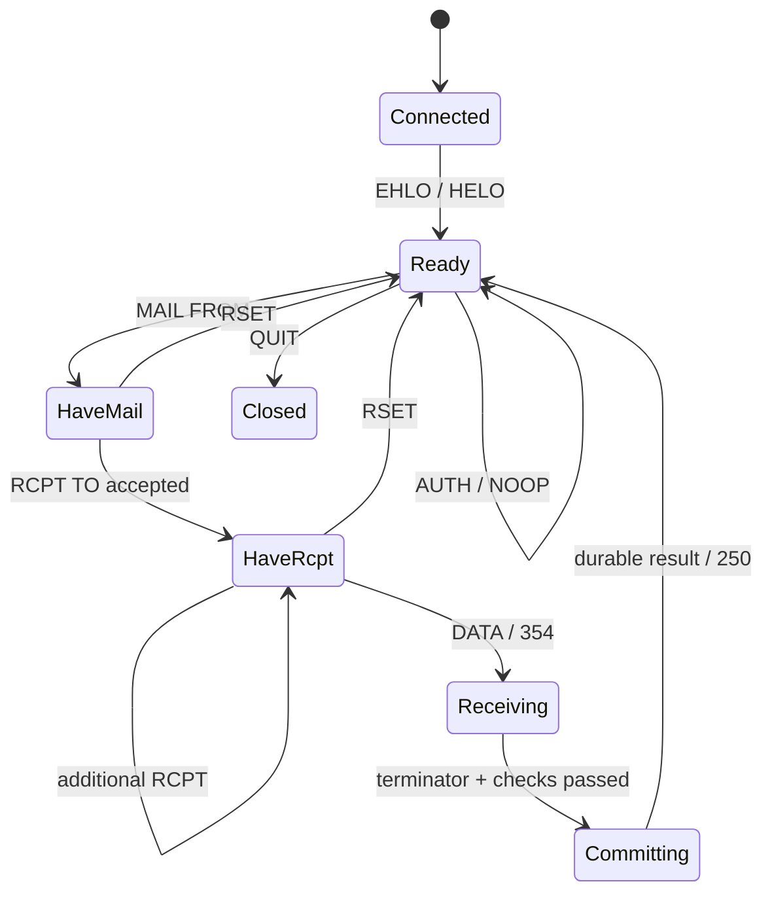

# SMTP、出站与 IMAP 协议契约

## 1. TCP 字节流先于邮件协议

`read()` 返回一次，不代表收到一条命令。`EHLO` 可以被分成任意几段；一次读取也能得到多个完整命令以及下一段的不完整前缀。解析器保留有界的未消费字节，只有 framing 完整时才驱动状态转换。

所有入口按字节处理，再按对应字段的语法解释文本。不能先把整个读取块转成 UTF-8 字符串；MIME 邮件体可以包含任意合法的编码字节。数值解析必须检查溢出，`{42949672960}` 不是可以直接 `reserve()` 的承诺。

为每个原始输入建立“所有切分点”测试：输入逐字节到达、CR/LF 分开到达、多命令合包，都必须产生同样的语义。无 CRLF 的流不能无限增长缓冲区。

## 2. SMTP 入口分工

| 监听 | 用途 | AUTH | TLS 与中继策略 |
| --- | --- | --- | --- |
| 25 | MTA 入站 | 不开放 | 提供 STARTTLS；收件地址必须是本地有效对象 |
| 465 | 用户提交 | 必须 | 建连即 TLS；认证成功后按发件权限开放远程收件人 |
| 587 | 用户提交兼容入口 | TLS 后开放 | STARTTLS 成功前禁止登录和提交 |

用户提交和 IMAP 采用强制 TLS。公共 MX 的 25 端口不能简单照搬“未 TLS 一律拒绝”的客户端策略；是否接受无 TLS 的外部邮件是明确的入站策略。默认允许普通互联网入站，同时向支持的对端提供 STARTTLS。[RFC 8314](https://www.rfc-editor.org/rfc/rfc8314.html)

本地域通过严格的规范化地址表路由，默认禁用 catch-all、自动 `+tag` 展开与外部转发。首发本地账号 local-part 采用 ASCII 大小写不敏感的管理政策，创建时拒绝规范化冲突；这只是本地政策，不能对外部收件地址盲目转小写。普通用户提交不允许使用空 reverse-path；空路径保留给外部入站和服务端生成的通知。地址解析遵守相应路径语法，不靠简单拆分 `@` 代替协议解析。

### 会话与事务状态

这是正常路径图；错误、超时、TLS 升级与关闭是显式分支。`RSET` 清除当前信封与预约，不注销认证；新的 `EHLO` 清除事务。重启 STARTTLS 后清除先前会话知识并重新 EHLO，不能复用 TLS 前流水线缓冲的数据。[RFC 3207](https://www.rfc-editor.org/rfc/rfc3207)

### 能力清单

| 能力 | 首发策略 | 附加要求 |
| --- | --- | --- |
| SIZE | 支持，最大原文 25 MiB | 声明大小用于预约；实际字节仍独立计数 |
| 8BITMIME | 支持 | 出站对不支持的下一跳不得原样偷偷发送 8-bit 内容 |
| ENHANCEDSTATUSCODES | 支持 | 错误映射集中定义，避免各模块自行拼响应 |
| PIPELINING | M4 完成测试后开放 | 有界命令队列，按顺序响应，不越过 DATA/TLS/AUTH 边界 |
| STARTTLS | 25 和 587 | TLS 后重建状态；465 不宣告再次升级 |
| AUTH PLAIN | 仅加密的提交入口 | SASL authzid 为空或获授权；Base64 不提供加密 |
| SMTPUTF8 | 首发关闭 | 国际化信封地址返回明确不支持；普通 MIME 中文邮件可用 |
| CHUNKING / BINARYMIME | 首发关闭 | 不宣告 BDAT；不是把 BDAT 当成 DATA 使用 |
| DSN 扩展 | 首发不宣告 | 仍生成常规失败通知；不声称实现 NOTIFY/ORCPT 等参数 |

语法解析能力不能直接透传到 EHLO。只有业务与持久化语义均实现的扩展才能公布。[PIPELINING](https://www.rfc-editor.org/rfc/rfc2920)、[SMTP AUTH](https://www.rfc-editor.org/rfc/rfc4954)

### DATA 的关键规则

应用选择严格 CRLF framing；拒绝裸 LF 等会导致网关解析分歧的输入。`\r\n.\r\n` 的识别和点转义跨缓冲边界保持一致，邮件开始处的空 DATA 也要正确处理。DATA 中看似 `RCPT TO` 的内容只是正文。不得通过宽松行解析制造 SMTP smuggling。

每条 RCPT 先校验路由与接收政策，250 表示本事务可以接收该地址，不表示已经耐久接受邮件。DATA 最终成功前，对已接受收件人形成一个原子 acceptance plan；首发不允许 DATA 失败却偷偷交付其中部分本地收件人。接收责任和失败处理依据 [SMTP 基础规范](https://www.rfc-editor.org/rfc/rfc5321.html)。

对超长输入，选择“回复错误并关闭”或“在有界丢弃预算内读到同步点”之一，并为每种状态写测试；不能提前回到命令态，把剩余攻击字节当作新命令。拒收原因应精确区分：语法无效、权限不足、单封超限、临时磁盘/扫描不可用。

在提交之前检查配额、反垃圾和授权。新增 Received 字段只引用已验证且经过转义的信息。原始外部 Authentication-Results 不被当作本机证明。入站 DKIM 在任何正文改写前验证；此项目默认不改写入站正文。

## 3. 自研出站投递

### 两种路由

中继模式：配置固定主机和 465 或 587；证书链和主机名必须验证，认证凭据不进入日志。禁止连接失败后暗中回退为直接 MX。

直接模式：解析收件人域的 MX，处理优先级、同优先级分散、A/AAAA、目标故障切换、DNS 超时与缓存。无 MX 但域有效时的隐式主机路径，与声明不收信的 Null MX 必须区分。Null MX 不能转而尝试 A 记录投递。[RFC 7505](https://www.rfc-editor.org/rfc/rfc7505/)

恶意收件域可能把 MX 指向内网。连接前对最终所有 A/AAAA 地址检查私网、环回、link-local、云元数据地址和本机地址；把检查后的地址直接用于连接，避免二次解析造成 DNS rebinding。私有企业路由只允许管理员显式配置的例外。

### 每收件人状态与不确定结果

一次事务可能有多个 RCPT，其中一部分返回 4xx，另一部分返回 5xx，剩余地址才进入 DATA。必须分别记录：可重试、永久失败、对端已接受。DATA 最终结果仅应用于本次 RCPT 接受集合。

远端最终 250 后本地更新状态失败，或 DATA 发完后 TCP 断开，均存在结果不确定窗口。保留原文和投递状态，等待重试，允许极少量重复；不能用 Message-ID 自动删除业务上合法的重复消息。运维视图单列 uncertain 数量。

初始重试计划是项目策略：30 分钟、1 小时、2 小时、4 小时，之后每 4 小时；加入 0–20% 正向抖动，最长 5 天。目的域共享退避，不能让一个失败域使 10 万条邮件同时再次连接。队列持久化 `next_attempt_at`，调度使用小批分页，禁止全部装入堆内存。

出站端分开配置 TCP、banner、各命令、DATA 写入与最终响应的超时；SMTP DATA 后的等待不能使用普通 HTTP 那样的短超时。详见性能文档中的超时预算。远端明确拒绝的代码与连接中断不合并成一种“发送失败”。

### 失败通知

永久失败或重试到期后，生成 `multipart/report; report-type=delivery-status`，采用空 reverse-path；报告收件人是原信封发件人，不能用正文 From 替代。失败报告本身失败不再生成失败报告。只附限长头部/诊断，避免包含完整私密附件。[RFC 3464](https://www.rfc-editor.org/rfc/rfc3464)

对公网入站尽可能在接受前判断本地收件人和策略；被接受后发生本机损坏等情况先告警和保留队列，不向可能伪造的 From 大量回弹垃圾。这里不能用“避免回弹”作为悄悄丢掉已接受邮件的理由。

### DKIM 与 8-bit 下一跳

用户提交邮件先完成头部校验、必要头部补齐和 Bcc 隐私处理，冻结将发送的字节，再签名。客户端发送的 Bcc 信封收件人仍要保留，Bcc 字段不对外泄露。禁止签名后改换行、编码或 MIME 边界。

对 8-bit 内容：如果下一跳不支持 8BITMIME，首发不实现自动 MIME 转码；明确失败并生成通知。上线中继应预先验收该扩展。不能为了兼容把已签名邮件静默重编码。出站原文变体以独立 BlobId 存储并追踪。

## 4. IMAP：客户端兼容不等于能 SELECT

首发完整实现并宣告 IMAP4rev1 核心；不宣告 IMAP4rev2。rev2 是新的综合规范，不能只把 capability 文本换掉就算升级。实现时建立 RFC 条款到测试的对照表。[RFC 3501](https://www.rfc-editor.org/rfc/rfc3501.html)、[RFC 9051](https://www.rfc-editor.org/rfc/rfc9051.html)

| 状态 | 必须实现的命令族 |
| --- | --- |
| 任意连接态 | CAPABILITY、NOOP、LOGOUT；非法状态返回合适 tagged 结果 |
| 未认证 | LOGIN 与 AUTHENTICATE PLAIN，仅 993 TLS 内 |
| 已认证 | SELECT、EXAMINE、CREATE、DELETE、RENAME、SUBSCRIBE、UNSUBSCRIBE、LIST、LSUB、STATUS、APPEND |
| 已选择 | CHECK、CLOSE、EXPUNGE、SEARCH、FETCH、STORE、COPY 与规范要求的 UID 形式 |
| 首发扩展 | UIDPLUS、IDLE、UNSELECT、MOVE；每项独立 capability 门槛 |

扩展依据：[UIDPLUS](https://www.rfc-editor.org/rfc/rfc4315)、[IDLE](https://www.rfc-editor.org/rfc/rfc2177)、[MOVE](https://www.rfc-editor.org/rfc/rfc6851)。不支持的 SORT、THREAD、CONDSTORE、QRESYNC、LITERAL+ 等不宣告；Gnus 必须测试无这些扩展时的实际行为。

### 五组不可省略的语义

1. **UID 与序号。** UID 在同一 UIDVALIDITY 内不复用；序号随 expunge 改变。客户端看到的事件与序号解释必须使用同一会话视图，不能每条命令直接拿数据库行号替代。
2. **字节长度。** literal 的长度是字节数；FETCH 返回 UTF-8 邮件时不能使用字符个数。APPEND 先验证声明长度与配额，允许后才发 continuation，并逐块落盘。
3. **只读与标记。** EXAMINE 不更改持久状态；BODY.PEEK 不设 Seen，普通正文获取按规范处理 Seen；STORE 的 add/remove/replace 和 SILENT 分别测试。
4. **结构和搜索。** ENVELOPE、BODYSTRUCTURE、header fields、MIME section、partial FETCH、日期、flags、UID set、嵌套布尔 SEARCH 和字符集处理要真正实现。正文搜索按需有界扫描；未支持字符集明确返回 BADCHARSET，不能伪造空结果。
5. **文件夹与并发。** INBOX 特殊规则、层级分隔符、LIST 通配符、modified UTF-7 名称、RENAME INBOX 特例、订阅关系和 Recent 归属均纳入实现。跨客户端 STORE/EXPUNGE 事件必须有顺序。

数据库更新与事件序号在同一事务提交。会话在协议允许的安全点发送变化通知；不在会让当前 FETCH/SEARCH/STORE 产生歧义的位置随意插入 EXPUNGE。慢会话积压超过预算后发送 BYE 并要求重连同步，不能无限保留历史。

### Emacs 的端到端路径

Gnus 启动 → TLS 登录 → LIST/LSUB → SELECT INBOX → UID SEARCH/FETCH → 读取正文和附件 → STORE Seen → SMTP 提交新邮件 → IMAP APPEND Sent → 另一会话读到变化。

SMTP 接受发信与 Sent 归档是两个独立事务。归档失败不代表邮件没发出去；客户端应保存草稿并仅补归档，不能盲目重发。服务器首发不自动保存 Sent，防止与客户端双重归档。
