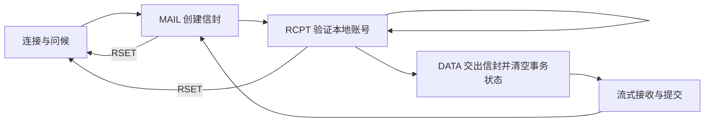
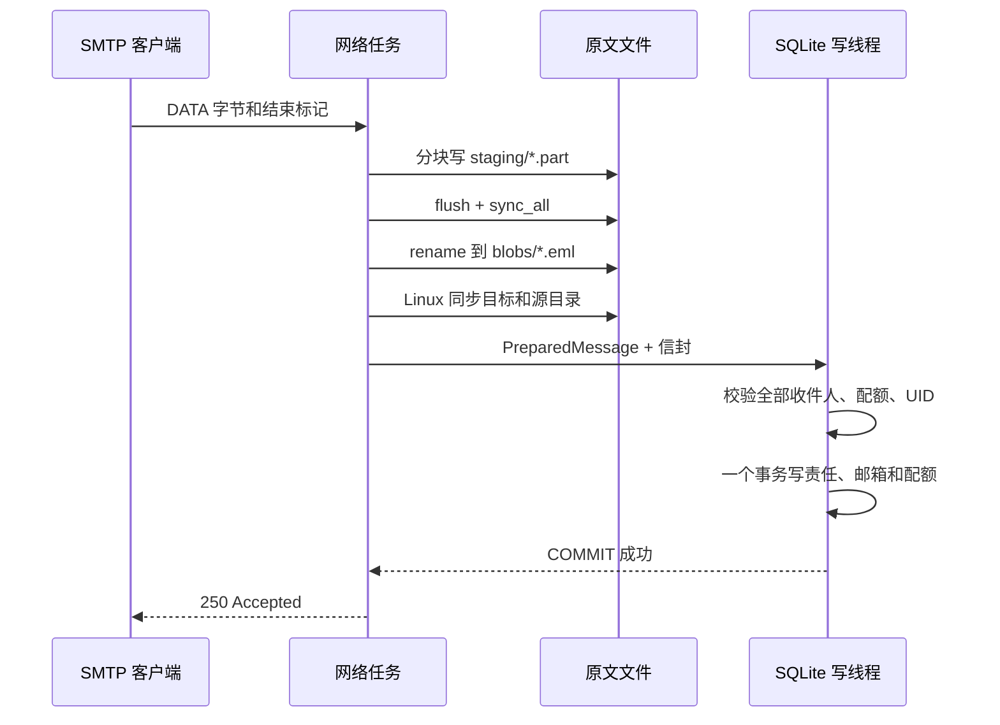

# 第一轮实现：让 SMTP 的 250 有证据

本章对应仓库的 0.1.0 L0 实验接收器。阅读完应能运行一封合成邮件，沿源码解释它为什么可见，并复现边界与故障测试。它不是完整邮件服务器的发布教程；生产路线仍由[实现计划](07-implementation-plan.md)约束。

## 1. 先运行，再读代码

准备 Rust 1.94.0、C 编译器和 Python 3.11+。工作目录为仓库根目录。开发构建与端到端实验：

```sh
cargo build --workspace --locked
python scripts/smoke.py
```

预期输出是 JSON，包含 `"result": "passed"`。脚本使用临时目录、随机环回端口、`example.com` 测试地址；SMTP 客户端使用 Python 标准库，不复用 Rust parser。它会在 DATA 最终 250 后直接杀掉子进程，检查磁盘中的原文与发出的 MIME 字节完全一致，再重启服务器。Windows 子进程隐藏窗口；不会修改 Emacs 配置或访问外部邮箱。

手动运行方法见 [README](../README.md)。停止服务、列信后，将输出中的 `message_id` 代入：

```sh
target/debug/rustymailctl --config deploy/rustymail.lab.toml mail export alice@example.com MESSAGE_ID --output first.eml
```

`MESSAGE_ID` 是占位值，不要照抄。导出文件必须不存在；已有文件会被拒绝覆盖。可使用文本编辑器检查头部、正文和行首点，也可用邮件阅读器打开 `.eml`。服务停止后执行 `check-store`，健康结果需满足 `healthy=true`、`missing_blobs=0`、`corrupt_blobs=0`。`orphan_blobs` 与 `staging_files` 是另一类问题，见后文。

本版默认 1 GiB 账号逻辑配额，可通过 `account add ... --quota-bytes 1048576` 为新账号设置 1 MiB。重跑相同账号创建会失败；这是避免静默覆盖已有数据的行为。`mail list --after-uid 50 --limit 20` 用 UID 游标分页，最大页长为 1000。路径相对于进程工作目录；切换目录前应显式设置配置和数据路径。

发布优化构建可以这样重复同一实验：

```sh
cargo build --workspace --release --locked
python scripts/smoke.py --bin-dir target/release
```

这验证优化后的二进制行为，不是性能基准。低内存、高吞吐目标需在规定 Linux VPS 上测量，不能从构建成功推导出来。

## 2. 源码地图与依赖方向

| 入口 | 要回答的问题 |
| --- | --- |
| [core 地址与配置](../crates/core/src/lib.rs)、[config.rs](../crates/core/src/config.rs) | 外部输入怎样变成有约束的内部类型？ |
| [protocol](../crates/protocol/src/lib.rs) | 字节如何成为一条命令？命令是否合法取决于什么？ |
| [store](../crates/store/src/lib.rs)、[blob](../crates/store/src/blob.rs) | 文件和数据库怎样一起承担接受责任？ |
| [server](../crates/server/src/lib.rs)、[worker](../crates/server/src/worker.rs) | 异步网络如何调用同步数据库，并限制资源？ |
| [rustymaild](../crates/server/src/bin/rustymaild.rs)、[rustymailctl](../crates/server/src/bin/rustymailctl.rs) | 命令行怎样声明当前能力、拒绝危险模式？ |
| [真实 TCP 测试](../crates/server/tests/smtp.rs)、[存储故障测试](../crates/store/src/tests.rs) | 如何证明某个故障不会变成错误的成功响应？ |

`core` 不依赖服务器；`protocol` 不访问磁盘；`store` 不懂 SMTP 响应；`server` 连接这几层。测试因此可以分别定位语法、会话、存储和网络错误。

本版复用 Tokio、rusqlite/SQLite、SHA-256、UUID、serde/TOML 和 clap。TLS、密码散列、MIME 与域认证库仍是后续阶段的选择。本版小范围 SMTP grammar 自行实现，拒绝 quoted local-part、地址字面量和扩展参数；成熟 parser 的完整适配仍需 M0 spike。局部可运行不等于已经完成 RFC 一致性验证。

## 3. TCP 给你字节流，不给你一行

客户端一次发送 `MAIL FROM:<a@remote.test>\r\n`，服务端可能分三次才读完，也可能同时读到后面的 RCPT。不能把一次 `read` 等同于一个应用报文。

本版 `LineDecoder::feed` 接受任意字节切片，返回“消费了多少字节”和“是否得到一条完整行”。网络层只消费这些字节，剩余输入仍留在 `BufReader`。CR 与 LF 可以来自两次读取；裸 LF、错误 CR、NUL 或超长行会失败，失败后不尝试从歧义输入继续恢复。

SMTP 命令行预算是 512 字节，DATA 解码后单行预算是 1000 字节，都包括 CRLF。线上的点转义允许额外一个点；结束标记 `.` 不作为正文存储。限制与透明传输语义参见 [RFC 5321 §4.5.2–4.5.3](https://www.rfc-editor.org/rfc/rfc5321.html#section-4.5.2)。

```text
线上：..leading dot\r\n    → 文件：.leading dot\r\n
线上：.\r\n               → 结束 DATA，不写入文件
线上：text\n              → 非法 framing，关闭连接
```

为什么不简单调用无限制的 `read_line`？攻击者可以一直不发送换行，迫使应用增长缓冲。本实现的上界由协议行预算决定；总消息体则逐行进入 16 KiB 文件缓冲，不收集为 25 MiB 的完整 `Vec`。这不意味着整个进程只占 16 KiB：还有网络缓冲、Tokio 文件缓冲、任务、连接表、SQLite 缓存和运行时开销。

实验：

```sh
cargo test -p rustymail-protocol every_split_and_one_byte_chunks_are_equivalent
cargo test -p rustymail-protocol rejects_smuggling_and_bounded_line_overflow
cargo test -p rustymail-server --test smtp bare_lf_and_partial_data_never_become_messages
```

第一个测试枚举切分位置并逐字节喂入；这比只检查一份完整字符串更接近 TCP 的实际契约。练习：如果恰好在 CR 后断连，应返回完整行、空输入还是截断错误？对照 `line` 的 `UnexpectedEof` 分支解释。

## 4. 解析器不等于状态机

`RCPT TO:<alice@example.com>` 语法正确，不意味着此时可以使用。是否已问候、是否存在 MAIL、是否还有收件人数额度，都属于会话状态。



`Session::apply` 返回 `Action`，如 `Reply`、`CheckRecipient`、`BeginData`。纯状态机不负责查数据库，网络层拿到查找结果后再调用 `recipient_result`。这样可以测试“有效地址，但账号不存在”，不把 SQL 隐藏进 parser。

当前实验账号仅允许收信，外域 RCPT 被拒绝；MAIL 发件人来自信封，消息头中的 `From:` 只是原文字节，不用于授权。相同本地地址去重；本地域和本地账号匹配忽略 ASCII 大小写，外部 MAIL local-part 保留大小写。

容易遗漏的错误：先发送合法 MAIL/RCPT，再发送畸形 MAIL。如果 parser 直接返回错误而没有清空旧事务，随后的 DATA 可能沿用旧收件人。因此网络层对语法错误的 MAIL 也执行 Reset，纯状态机对超大 SIZE 的 MAIL 同样先清空状态。

```sh
cargo test -p rustymail-server --test smtp rejects_relay_unknown_users_and_malformed_mail_clears_old_transaction
```

练习：给状态机画出“无 MAIL 的 RCPT”和“无 RCPT 的 DATA”的转换；然后解释为什么 RCPT 成功不能永久保证 DATA 最终提交成功。提示：账号状态和配额需要在提交事务中再次检查。

## 5. 最终 250 是持久化责任的边界

本地消息经过以下顺序：



`StagedMessage` 只能写临时文件；`prepare(self)` 消费它并返回 `PreparedMessage`；后者字段私有，外部调用者不能直接伪造。类型把“尚未准备好的正文”挡在数据库提交接口外。它不是磁盘绝不会出错的证明，仍需检查每个 I/O 结果。

SQLite 使用 WAL 与 `synchronous=FULL`，整个邮箱责任事务由一个专用线程提交。FULL 在 WAL 模式下要求每次事务提交同步 WAL；性能成本必须计入测试。[SQLite 官方说明](https://www.sqlite.org/pragma.html#pragma_synchronous)也明确依赖底层同步语义。将 FULL 改为 NORMAL 不能当作保持同等耐久性的优化。

文件与数据库不是同一个原子事务。先准备文件，再记录引用，失败倾向于留下没有数据库引用的文件，而不是数据库指向不存在的原文。本版保留这些 orphan，不自动删除；配额拒绝、幂等重放和崩溃都可能产生 orphan。离线 GC 尚待实现，长期运行会积累磁盘用量，因此这版不能作为长期生产服务。

配额按邮箱逻辑字节记账。一次发送给 Alice 和 Bob，只要其中一个配额不足，所有本地投递一起回滚。正文文件可以存在，但两人的收件箱都不可见这条未接受事务。UID、邮箱事件序号和账号用量与投递一起变更；计数溢出必须拒绝，不能回绕。

```sh
cargo test -p rustymail-store quota_and_missing_recipient_roll_back_every_recipient
cargo test -p rustymail-store alias_uid_exhaustion_rolls_back_without_wraparound
cargo test -p rustymail-store internal_retry_is_idempotent_but_conflicting_key_is_rejected
```

内部 `operation_id` 允许重复调用得到同一个提交结果，但重放必须匹配原文摘要、长度、信封发件人和收件人集合。它不能消除外部 SMTP 重试的重复邮件：数据库已提交而 250 在网络上丢失时，对端不知道结果，重发会成为新的事务。互联网端到端 exactly-once 不是本系统的承诺。

COMMIT 返回异常或提交结果通道超时时，服务器保守地关闭连接，不发送“肯定没有接收”的 4xx。后续应补充可操作的 operation 查询和故障诊断工具；当前 CLI 只能列信与检查存储，不具备完整的未知结果调查界面。

## 6. 异步不会自动带来有界资源

网络运行在 Tokio；同步 SQLite 由一个 OS 线程独占，通过容量固定的 mpsc 队列接收请求。不能为每个 RCPT 随意创建无限多个 `spawn_blocking` 任务，否则线程池队列会成为隐蔽的内存堆积点。

连接许可、按 IP 活动连接数、DATA 并发、最坏消息大小的磁盘预留共同控制入口。预留令牌随 staged/prepared 对象持有；即使网络 future 被取消，已经派发到阻塞线程的工作仍占预留和实例锁，直到对象真实释放。对象 Drop 释放许可，避免成功路径和十个错误路径各写一套计数回收代码。

磁盘预留是“本进程的保守准入预算”，不是文件系统保留空间。其他程序仍可能耗尽磁盘，实际写入和同步必须处理 ENOSPC。本版尚未完成磁盘满故障注入。

SQLite 缓存大小和排队数量可配置。内存用量近似由“活动连接 × 网络缓冲 + 活动 DATA × 文件缓冲 + 缓存 + 运行时”组成，不随单封正文长度线性增长。25 MiB 分块测试证明代码路径可流式完成，不能证明某个 RSS 数字。当前没有吞吐、延迟或内存测量结果。

命令超时包住一整条 `line`，每来一个字节不重置期限，防止每隔一小段时间发送一个字节的连接无限占位。DATA 有每行期限和整个事务期限；本版 `data_idle_seconds` 实际作为单行完成期限使用，比“每收到字节重置的空闲时间”更严格。

```sh
cargo test -p rustymail-server --test smtp slow_command_expires_instead_of_extending_deadline_per_byte
cargo test -p rustymail-store reservations_and_instance_lock_live_until_prepared_token_is_dropped
```

### 取消一个 future 不会撤销已经写出的字节

`write_all` 不是取消安全操作：它被丢弃时，可能已写出前缀。[Tokio 官方 API](https://docs.rs/tokio/1.53.1/tokio/io/trait.AsyncWriteExt.html#method.write_all)列出了这项约束。若只在 I/O 返回 Err 时标记失败，被取消的调用根本没有机会执行那个分支。

本版在开始 await 前把 stage 标成 poisoned，只有完整写入并更新摘要/长度后才恢复。取消以后再次 `prepare` 会失败。回归测试占满唯一阻塞线程，手动 poll 大块 append 到 Pending 后丢弃 future，最后检查 token 无法提交：

```sh
cargo test -p rustymail-store cancelling_a_pending_append_poisoned_the_stage
```

还要注意另一层缓冲：第一次小块 Tokio 文件写入可能只是复制进内部缓冲就返回成功，并没有等待系统写盘。测试不能根据“小块 write 返回成功”判断磁盘工作结束；生产 prepare 必须 flush、sync，并等待文件操作完成。代码显式限制了 Tokio 文件缓冲与外层 BufWriter 的大小。

练习：`timeout(store.accept(...))` 超时后，写线程是否停止？找到 worker 中 `Request::Accept` 的处理顺序，解释为什么不能把客户端等待结束当作数据库事务撤销。

## 7. 真实测试发现的问题

| 观察 | 根因与修复 | 验证 |
| --- | --- | --- |
| 超额连接偶尔读到 EOF，而非 421 | 新接收的非阻塞 socket 尚未标为可写；直接 `try_write` 可能返回 WouldBlock。改用最多等待 250 ms 的 `write_all`，不创建无限拒绝任务 | `per_ip_connection_limit_rejects_before_starting_a_session` |
| rusqlite 编译时拒绝某些 u64 参数/返回类型 | SQLite INTEGER 为有符号 64 位；使用受检转换和明确上界，读取负数报错 | 配额、UID 极限与幂等存储测试 |
| Windows 冒烟测试子进程输出解码异常 | Python 文本模式采用本地编码，而 Rust 输出 UTF-8；显式指定 `encoding="utf-8"` | 独立脚本完整执行 |
| Drop Store 后 prepared token 仍在另一个任务中 | 若进程锁只属于 Store，会允许新实例与残留准备动作并发；让 token 共同持有锁 | reservation/lock 生命周期回归测试 |
| Linux CI 的存储测试统一报 UnsafePermissions，Windows 通过 | 测试错误地假定 tempfile 目录默认私有；显式以 0700 创建 Unix fixture，继续拒绝 0755 数据目录 | Unix 权限负例与两平台 CI；没有降低生产路径的权限要求 |
| Linux 并行故障测试期间，关闭 Store 后重开偶发 Locked | 子进程继承的描述符可延长 flock 生命周期；最终 Rust 锁持有者 Drop 时显式 unlock，所有暂存/准备令牌仍共同持有锁 | Unix 受控继承用例：子进程仍持有描述符时，父进程最后持有者释放后能重新加锁 |

这些是本轮实现中的具体发现，不能推导成“所有 Windows/Rust/SQLite 程序都有相同问题”。修复后仍需持续验证依赖升级、Unix 文件系统和运行负载的差异。

权限案例可对照 [tempfile Builder 的 Unix 说明](https://docs.rs/tempfile/3.27.0/tempfile/struct.Builder.html#method.permissions)：默认目录权限还受 umask 影响；随机名字不等于目录私有。测试应创建满足服务契约的 fixture，再单独测试不满足契约的目录会被拒绝。

锁案例体现“Rust 所有权”与“内核资源引用”不是同一层：CLOEXEC 在 exec 时关闭描述符，不能消除 fork 到 exec 之间的继承窗口。受控用例通过子进程标准输出显式传入锁描述符，并用 stdin 管道延长窗口；无需在 Rust 中引入 unsafe fork。最终 Arc 释放时执行 unlock，提前释放 Store 本身则不会越过仍活跃的 prepared token。

## 8. 故障实验怎样读

```sh
cargo test -p rustymail-store child_process_crash_matrix_preserves_only_committed_messages -- --nocapture
```

该用例启动真正子进程，在六处 `process::exit(86)`，绕过 Rust 析构：

| 退出位置 | 重启后的可见责任 |
| --- | --- |
| staging 写入后 | 无邮箱投递，可残留临时文件 |
| 文件同步后 | 无邮箱投递，可残留临时文件 |
| rename 后 | 无邮箱投递，可残留 orphan |
| 目录同步后 | 无邮箱投递，可残留 orphan |
| SQL COMMIT 前 | 无邮箱投递，SQLite 回滚未提交事务 |
| SQL COMMIT 后 | 邮箱中恰好一条，原文与摘要完整 |

父进程重新打开存储并流式计算每个引用 blob 的 SHA-256，检查内容与数据库的关系。启动服务也会做这个全量检查；大邮箱的启动时间因此随存量正文增长。将来需分离快速启动检查和完整 scrub，但不能用跳过损坏处理换取启动速度。

进程退出不等于机器断电：OS 页缓存还在，磁盘缓存、目录持久化和虚拟化层没有被模拟。Windows 的目录同步实现明确为空操作，输出 `directory_sync_supported=false`。即使 Linux CI 通过，也必须继续做 VM 掉电和真实文件系统实验，才能宣称耐久性门槛通过。

## 9. 当前与设计的差距

迁移采用 SQLite `PRAGMA user_version=1`，未来版本拒绝启动；没有声称已实现完整迁移历史或降级工具。blob 暂用单层目录，未分片；MIME 元数据写入空占位对象，不能供 IMAP FETCH 使用。账号创建只生成接收权限，没有密码或可登录身份。配置中的未来字段仅有结构验证，`logging.level` 等字段尚不驱动完整可观测性系统。

无 TLS/AUTH、IMAP、出站队列、退信、域认证、反垃圾、备份/GC、指标端点，也没有 Received/Return-Path 注入与 MIME 语义验证。`serve` 始终拒绝，`serve-lab` 要求环回地址、`delivery.mode="disabled"`、`spam.required=false`。不要通过转发端口把它暴露给公网，也不要降低现有 Emacs 客户端的 TLS 设置来迁就实验端口。

接下来的实现应先收紧 M1 的磁盘满、掉电和恢复工具，再完成 M2 TLS/认证与在线管理；最终按 M3–M8 补齐 SMTP、队列、IMAP 和生产验收。M0 的 IMAP literal、MIME worker 与依赖公告审计仍需单独关闭。每阶段继续保留可运行实验与真实限制，不将路线图上的功能写成已经实现。
