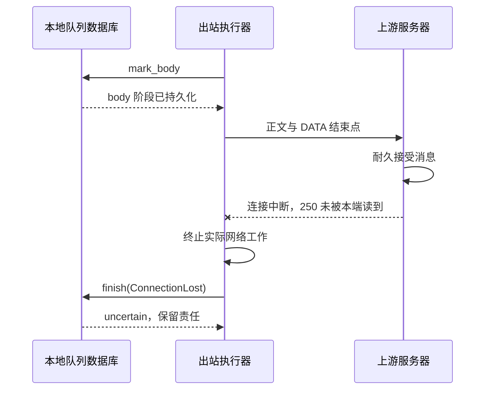

# M4.1：逐收件人的持久队列与不确定结果

本章对应 0.7.0、数据库 schema 3。先阅读[存储恢复](11-m1-storage.md)、[取消与资源边界](13-cancellation-and-bounds.md)和[最终本地交付](15-m3-local-delivery.md)。本轮交付队列存储 API、离线管理及故障实验；**没有出站 SMTP 客户端，没有后台发送循环，也没有开启远程 RCPT。** 固定上游 TLS 中继属于 M4.2，失败通知属于 M4.3。[验证报告](../reports/m4.1/validation.md)记录实际运行范围。

学完本章，应能解释四件事：为什么一封邮件需要多条投递责任；为什么数据库提交不能证明对端是否收信；为什么超时不能代表旧任务已停止；怎样用索引和生命周期约束控制内存与并发。

## 1. 从一个具体故障推导模型

同一封邮件有 A、B、C 三个远端收件人。A 的最终 DATA 得到 250，B 在 RCPT 得到 450，C 在 RCPT 得到 550。正确结果分别是成功、稍后重试、永久拒绝；不能把整封邮件统一标为成功，也不能为了 B 再向 A 发送一次。

还要区分 RCPT 的 250 与 DATA 结束后的 250：前者只接受本次事务的收件人，后者才表明消息传输成功。将来共享一次 SMTP 事务时，DATA 的最终结果只作用于已通过 RCPT 的收件人。本轮测试直接输入归一化结果，**尚未验证网络响应到这些结果的映射**。M4.2 必须通过独立上游测试补齐它。协议依据见 [RFC 5321 §4.2.5](https://www.rfc-editor.org/rfc/rfc5321.html#section-4.2.5)。

更难的情况是：对方保存了邮件，250 在返回途中丢失；或者本端读到了 250，却在记录成功前崩溃。本端只能观察到“没有保存成功结果”，不能推导“对方没有收到”。SMTP 没有通用的跨服务器事务提交协议，也没有要求对方按 Message-ID 去重。因此本项目不会承诺恰好一次；优先保存责任，并显式暴露重复窗口。规范对超时与重复的讨论见 [RFC 5321 §6.1](https://www.rfc-editor.org/rfc/rfc5321.html#section-6.1)。

单个 TCP 丢包通常由重传处理；这里的不确定性出现在连接失效、超时或本端崩溃，导致应用不能确认最终结果时。下面是未来 M4.2 网络执行器必须遵守的顺序；M4.1 只验证其中的数据库转换：



## 2. 数据库已经保护了什么，还缺什么

schema 1 已有 `delivery` 的状态、尝试次数、到期时间、token 和 generation；当时并没有队列执行路径。新[迁移 0003](../crates/store/migrations/0003.sql)补充两个表及三个部分索引：

| 对象 | 含义与约束 |
| --- | --- |
| `message` / `blob` | 一份信封及不可变文件；同一入队操作的收件人共享正文 |
| `delivery` | 每个收件人一行；`(message_id, recipient)` 唯一；保存状态、重试和租约 |
| `queue_message` | 外发表示的 BODY 模式及初始生命周期；引用 message，生命周期为 1 秒至 7 天 |
| `queue_lease` | 当前尝试的 `ready` 或 `body` 阶段；引用 delivery；完成时删除 |
| `queue_ready` | 仅索引 relay 的 pending/deferred，按到期时间与 ID 排序 |
| `queue_recovery` / `queue_list` | 分别供 leased 恢复扫描、relay 元数据分页 |

SQLite 的事务、外键、唯一约束、CHECK 能保证所表达的本地规则。例如入队事务回滚时，不会只留下三个收件人中的两个。`BEGIN IMMEDIATE` 先取得写事务；token/generation 的检查和更新在同一个短事务内完成，期间没有另一个写者改变事实。[SQLite 事务文档](https://www.sqlite.org/lang_transaction.html)说明了该锁定模型。

但数据库不知道一个文件是否已经同步到持久存储，也不知道远端是否处理了 DATA，更不知道一个 Rust future 的底层工作是否仍在继续。甚至“leased 必须恰好存在一行 queue_lease”这个跨表双向条件也没有由现有外键完整表达。应用必须按协议更新，并通过 `check-store` 的 `queue_mismatches` 检查交叉不变量；测试会故意删除 phase 行，验证检查能报告损坏、旧租约无法继续操作。发现损坏应停止并调查，不能凭空补一个 ready 阶段来自动重发。

### 入队提交顺序

1. 调用 `stage → append → prepare`，有界写入；文件同步、rename、目录同步完成后取得 `PreparedMessage`。
2. 验证 operation ID、信封、收件人数和生命周期。单次最多 100 个输入收件人。
3. 一个事务写入 blob、message、queue_message 和全部 relay delivery。
4. 提交确认后返回 message ID；提交结果不明时按 operation ID 查询/重放。

文件同步失败不能产生已接受引用；文件已持久化而事务未提交则可能留下 orphan，由已有离线 GC 处理。这沿用[存储有序提交](03-storage-and-recovery.md)；WAL/FULL 依赖底层同步实现，不替代真实存储故障验收。

operation ID 是内部操作键。重放必须保持正文 SHA-256/长度、信封发件人、收件人集合、BODY 模式及生命周期相同，否则返回冲突；不把本地接受操作误当成外发入队。完全一致的重放不会重置已经 delivered 的任务。外域地址的 local-part 保留大小写，`Case@remote.test` 与 `case@remote.test` 是两条责任；只有域名规范化。这与本项目本地域账号的不区分大小写策略不同。

空 reverse-path 存为 `""`，API 使用 `None`；它不是“未知发件人”。本轮没有通知生成器，空发件人测试只证明其持久化正确和没有额外消息，不能宣称 DSN 循环防护已完成。

## 3. 状态与失败路径

| 当前状态 / 事件 | 持久结果 | 自动领取 |
| --- | --- | --- |
| 新入队 | pending | 到期可领取 |
| 领取并提交租约 | leased + ready | 此任务不可再次领取 |
| 正文发送前的持久标记 | leased + body | 此任务不可再次领取 |
| 明确最终 2xx，且已进入 body | delivered | 不领取 |
| 明确 4xx | deferred，计算下一次时间 | 到期可领取 |
| 明确 5xx | failed，保存归一化诊断 | 不领取；尚无 DSN |
| ready 阶段连接丢失 | deferred | 到期可领取 |
| body 阶段连接丢失 | uncertain | 不自动领取 |
| 等待任务寿命到期或计数耗尽 | hold | 不自动领取、不删除正文 |
| 管理员 hold | hold | 不自动领取 |

`queue_mark_body` 必须在写出任何 DATA 正文字节**之前提交成功**。即使只发送了部分正文、尚未发结束点，断线也保守进入 uncertain。这会暂停一些事实上没有成功的投递，但简化第一版的可证明边界；以后如细分“结束点已写出”，必须重新验证预读、缓冲写入、取消和崩溃顺序。

`queue_finish` 消费不可克隆的租约，调用者必须先停止真正的网络尝试。Delivered 只接受 body 阶段的 2xx；Temporary/Permanent 只接受各自代码范围。任意对端回复字符串不进入此 API，数据库仅保存固定诊断，避免把凭据、正文或控制字符写入日志。实际 SMTP 客户端仍须保证将 250 的正确语义传进来，类型不能自动证明网络事实。

`QueueOutcomeUnknown` 表示状态提交可能成功：调用方不能凭这个错误强行把任务改回 pending。重新打开并检查当前记录，必要时执行恢复。已提交 delivered 的任务保持成功；未提交成功但处于 body 的任务转 uncertain。

### 独立进程终止实验的预期矩阵

| 强杀位置 | 重启前数据库可见 | 恢复后 |
| --- | --- | --- |
| enqueue 提交前 | 无任务 | 无任务，可能有 orphan |
| enqueue 提交后 | pending | pending |
| claim 提交前 | pending | pending |
| claim 提交后 | leased / ready | deferred |
| body 标记提交前 | leased / ready | deferred |
| body 标记提交后 | leased / body | uncertain |
| finish 提交前 | leased / body | uncertain |
| finish 提交后 | delivered | delivered |

这里的“finish 成功”由实验注入，没有真正的上游。测试以 stdout 标记停在边界，然后父进程使用 SIGKILL/TerminateProcess 结束子进程；不是正常析构，也不是只抛一个异常。它仍然不模拟磁盘掉电。既有 Linux QEMU 存储实验继续回归，不能把它写成已经专门覆盖八个新队列断电位置。

## 4. 租约期限为何不能单独回收任务

如果租约到期后旧 worker 仍在向远端写数据，立刻重新派发就会同时发送两次。token/generation 可以拒绝旧 worker 对本地数据库的迟到更新，却不能撤销它已经发给远端的字节。

本实现采用单 Store owner、独占实例锁和实际工作所有权：

- `QueueLease` 持有 `Arc<LeaseGuard>`；guard 持有实例锁，记录目标域。
- 正文 `QueuedReader` 也持有同一 guard。丢掉上层租约或 Store，尚未结束的读者仍保护锁和并发槽。
- Store 只保存 Weak 注册项，回收已无强引用的记录；有强引用的任务，即使 `lease_until_ms` 已过去也不能重派。
- `queue_renew` 延长期限，token、generation 及实例身份必须仍匹配。期限是执行器的监控依据，不是“真实 I/O 已停止”的证明。

将来的网络 worker 必须让 guard 覆盖从连接到关闭的整个实际生命周期。超时后先取消并等待网络工作停止，再交回结果/释放所有权；不能把 guard 留在已经结束的外层 future，而让分离任务继续发送。当前 API 没有后台 watchdog；M4.2 必须实现并测试它。

进程重启后，旧进程的锁和内存 guard 已不存在。恢复 leased 任务按持久 phase 分类，无须仅凭墙上时钟等到租约过期：ready 延期 30 分钟；body 进入 uncertain。这个固定恢复延迟是保守项目策略，独立于普通重试阶梯。单次最多扫描 128 行，游标留在 Store 内；运行中扫描到的可能全是活任务，所以“本次恢复 0 条”不等于全队列已经扫描完。

## 5. 有界调度与正文读取

`queue_claim` 每次最多检查 128 个到期候选；全局活动上限最多 128，默认 16；每域默认 2，且不能超过全局上限。内存保存一小批元数据及活动 guard，不把整份 backlog 或正文加载进内存。SQL 使用部分索引、键集游标及 `LIMIT`，避免 OFFSET 逐页变慢和对所有到期行临时排序；测试用查询计划验证索引及无临时排序。

若前 128 条全属于已饱和的同一个域，扫描游标继续向后推进，下次能看到其他域。扫描至尾部后回到起点，让之前跳过或新插入的任务获得机会。一次空结果可能只代表这一批没有额度，未来循环必须继续安排有节制的扫描，不能忙等，也不能误判整个队列为空。本轮 131 条测试验证跨批进展和额度，没有声称严格按域公平或大存量吞吐已达标。

领取额度按实际 guard 计数；即使数据库结果已经完成，只要读者仍持有 guard，额度仍保留。正文通过 `Read` 流式读取并计算 SHA-256，真正 EOF 时校验长度和摘要。同长度篡改也能检出，无需整封缓存。**未来执行器必须读取到通过校验的 EOF，才可以向 SMTP 对端发送最终结束点。** 读到预期字节数就停，不能替代 EOF 校验。发现损坏必须断开尝试并报告，不发送结束点。

目前成功结果 API 信任内部执行器遵守上述契约，没有将“已验证 EOF”做成必需类型凭证；M4.2 集成测试须覆盖损坏、截断和读失败。文件 `Read` 是同步接口，异步执行器应放在受限 blocking 工作中，不能在 Tokio 调度线程做任意磁盘读取。读取缓冲大小由调用方负责，CLI 导入使用配置中的流缓冲（默认 16 KiB）。这些是有界结构设计，不是“完全内存安全”或具体 RSS 的证明；依赖库和 SQLite 仍有自己的内存预算。

## 6. 退避、时钟与过期

普通临时失败默认依次等待 30 分钟、1 小时、2 小时、4 小时，之后保持最后一级；以 delivery ID 和尝试次数计算确定性的 0–20% 正向抖动，避免大量任务同一时刻重试，也便于重现。只增加延迟，保留配置的最低等待时间。配置检查限制阶梯长度、延迟和抖动范围，计算不会因极大的尝试次数越界。RFC 建议延迟重试并保留数日队列，见 [RFC 5321 §4.5.4.1](https://www.rfc-editor.org/rfc/rfc5321.html#section-4.5.4.1)；这里的具体数值与恢复 hold 策略是项目选择。

持久时间使用 UTC 毫秒；同一 Store 生命周期内，用单调时钟经过量核对墙上时钟变化。发生回拨、单调值回退，或相对起点偏差超过 60 秒后，新的 claim、renew、显式 retry 返回 `ClockChanged`，直到管理员检查时间并重开 Store。已知远端结果仍允许保存，避免“已知道成功，却因为时钟告警丢弃结果”。当前只返回错误，还没有服务指标/告警管道；这也是后续执行器和运维的任务。

进程关闭期间没有单调时间基准，重启不能证明其间发生过多少墙钟跳变。因此超期任务进入 hold，不会批量标永久失败或自动生成退信。普通到期任务也采用同一保守策略；这尚不是完整生产到期处理。管理员可显式延长初始生命周期后重试。enqueue 记录当前时间，但不依赖调度时钟门禁；本轮只供可信离线导入，未来在线接受须另外定义时钟异常时的接收政策。

## 7. 可运行操作

使用独立实验目录；以下配置默认为 `data/lab`。先停止所有使用该目录的 rustymail 服务。操作都在本地，不会发送外部邮件：

```sh
cargo build --workspace --locked
target/debug/rustymailctl --config deploy/rustymail.lab.toml account add alice@example.com
target/debug/rustymailctl --config deploy/rustymail.lab.toml queue import-lab --source sample.eml --operation-id 11111111111111111111111111111111 --sender alice@example.com --recipient target@remote.test
target/debug/rustymailctl --config deploy/rustymail.lab.toml queue list --limit 50
target/debug/rustymailctl --config deploy/rustymail.lab.toml check-store
```

`sample.eml` 是自己准备的合成邮件文件；账号创建只做一次，用于初始化实验存储。`import-lab` 需要已有目录，拒绝本地域收件人；省略 `--sender` 表示空 reverse-path。它原样保存文件，不验证完整 RFC 内容、不添加 Received/Return-Path、不执行认证或 send-as，不能当成可对外开放的提交入口。BODY 默认 `7bit`，可选 `--body 8bitmime`；生命周期默认五天。operation ID 是 32 位小写十六进制，每个新操作使用新的随机值，相同操作重放才复用。

`queue list` 每行一个 JSON 对象，最多 128 行；用最后一行的 `id` 作为 `--after-id` 继续。列表不暴露 token，但收件人仍属于敏感管理元数据。以下 `DELIVERY_ID` 替换为列表中的实际 ID：

```sh
target/debug/rustymailctl --config deploy/rustymail.lab.toml queue hold DELIVERY_ID
target/debug/rustymailctl --config deploy/rustymail.lab.toml queue retry DELIVERY_ID --allow-duplicate
target/debug/rustymailctl --config deploy/rustymail.lab.toml queue recover --limit 128
```

uncertain 和 hold 都要求 `--allow-duplicate`：hold 可能来自 uncertain，不能通过先 hold 再 retry 绕过确认。若已过期还需要 `--extend-expired`；failed/delivered 不允许重发。retry 只改待调度状态，输出 `transmitted:false`。离线 CLI 没有活动 owner；分批 recover 到 `recovered < scan_limit` 后，再查列表和完整性报告确认。该规则不适用于将来的在线扫描。

GC 仍只删除无引用文件；队列中 pending、uncertain 甚至已完成的历史引用都会保留正文。当前没有历史清理、自动退信或队列删除命令，长期运行需考虑磁盘增长；不能用手工删库行来模拟过期策略。

### schema 2 → 3 的升级

首次打开时由已有迁移框架原子执行 0003 并记录摘要；1 → 3 同样受迁移事务保护。没有重写旧 blob、UID、配额和本地 delivery。测试在已有本地邮件的可丢弃 schema 2 fixture 上分别中断迁移提交前后，重开后检查记录与 UID；测试中的 DROP TABLE 只用于构造旧版本临时 fixture，绝不是运维降级方法。

升级前停服务，备份一致的元数据和 blob；旧版二进制会拒绝 schema 3，不能仅替换旧可执行文件回滚。若需要回退，恢复升级前的完整一致快照，并处理升级后新增数据；完整生产回滚演练仍属于 M7。

## 8. 源码与实验导读

| 阅读位置 | 重点 |
| --- | --- |
| [queue.rs](../crates/store/src/queue.rs) | enqueue 顺序、租约 guard、索引扫描、状态迁移、流式校验 |
| [queue_tests.rs](../crates/store/src/queue_tests.rs) | 逐人结果、提交故障、过期活任务、时钟、跨域进展、损坏及迁移 |
| [runtime.rs](../crates/store/src/runtime.rs) | 可替换双时钟、正常构建中禁用的故障钩子 |
| [rustymailctl.rs](../crates/server/src/bin/rustymailctl.rs) | 可信离线管理入口与有界导入 |
| [m41_probe.rs](../crates/store/examples/m41_probe.rs) / [m41_smoke.py](../scripts/m41_smoke.py) | 同步故障标记、真实进程终止、独立 SQLite 观察与恢复 |

```sh
cargo test -p rustymail-store --all-features --locked queue
cargo build -p rustymail-store --example m41_probe --features test-support --locked
python scripts/m41_smoke.py
python scripts/check_docs.py
```

独立脚本使用临时目录和合成内容，通过公开 CLI 检查入队、分页、幂等冲突、hold/retry、GC 保护，并强杀八个提交边界；不发送外网邮件。正常服务没有环境变量形式的故障开关。完整回归还运行既有 SMTP、TLS、权限矩阵、压力和存储实验，见验证报告。

自测问题：

1. 为什么 RCPT 250 不能转 delivered？为什么 body 后没有成功记录又不能直接断言失败？
2. 如果 lease_until 已到，但读者还活着，重新领取会破坏哪个不变量？token 为什么救不了远端？
3. 如果领取查询先取全部到期行再在 Rust 截断，LIMIT 和内存约束还成立吗？
4. 如果 hold 不需要重复确认，怎样绕过 uncertain 的保护？
5. 从持久数据上，能否区分“远端没有收下”与“远端收下但 250 丢失”？需要什么额外协议才能改变答案？

答案线索依次在第 1、4、5、7、1 节；回答时请分别指出本地事实、远端事实及无法观察的部分。

## 9. 下一步的具体边界

M4.2 接固定配置上游的 TLS SMTP 客户端，验证证书/主机名、协商 BODY、逐 RCPT 结果、DATA 最终结果、超时和实际任务取消；不根据任意收件域直接连接未知地址。接受侧需先设计本地与外发两种表示、原子混合责任与事务内授权，避免将最终本地 Return-Path 原样作为中继头部，也不能让本地成功与外发失败形成半接受。

M4.3 再补 DSN 唯一通知、空 reverse-path 不退信、到期与 uncertain 运维策略、PIPELINING 及故障互通。M4.1 的 failed 只是持久状态，不能当作“已通知用户”。Emacs 配置本轮保持既有 TLS 要求；完整 Gnus 收发仍等待 M5，不绕过验证去伪造当前尚不存在的外发/IMAP 闭环。
