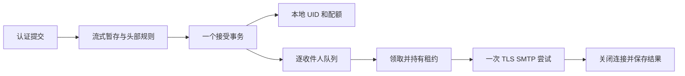

# M4.2：从一封真实发送到持久 TLS 中继

本章对应 0.8.0、schema 3。现在可以通过认证提交邮件，原子保存本地与远端责任，再由后台执行器通过固定上游的 TLS SMTP 连接发送。入站监听仍限制在环回；`serve` 仍拒绝生产启动。没有 IMAP、DSN、域认证、反垃圾或直接 MX 投递。实际证据见 [M4.2 报告](../reports/m4.2/validation.md)。

建议先运行第 7 节的独立实验，再阅读[队列基础](17-m4-durable-queue.md)与本章源码。学完应能区分三件事：开发时怎样尽早得到反馈，运行时哪些责任不能省略，以及怎样把“不知道是否成功”正确保留下来。

## 1. 先跑通，再让每一步承担明确责任

分层描述的是模块依赖，开发顺序还应考虑验证成本。本轮先写一个单次 SMTP 尝试，让 Rust 通过真实 TCP 向独立 Python 对端发送合成邮件；随后加入拒绝、断连和畸形响应，再接入 TLS、认证，最后连接已存在的队列与接受事务。这是一个逐渐加深的端到端实现过程。

最小实验不需要数据库、调度器和公网域名，只需要能够观察线上的字节。它很早就能暴露错误：把 RCPT 250 当成发信完成，错误处理点转义，或在收到多行回复的第一行后就发送下一条命令。队列负责的崩溃恢复仍然重要，但这些协议事实可以先独立验证。

普通二进制只构造验证证书的 TLS 客户端。明文构造函数只存在于 `test-support`/测试构建，且拒绝非环回地址。这样可以直接学习 SMTP 字节流；正式执行器接入后仍保持同一个尝试接口。



单次尝试不自行重试；调度器不解析 SMTP 回复；存储层不猜远端事实。三者通过 `RelayMessage`、`QueueLease` 和归一化 `QueueResult` 对接。不能为了演示成功而把数据库里的责任提前标为 delivered。

## 2. TCP 连通之后，邮件如何真正被上游接受

第一版一次连接只投递一个远端收件人，顺序如下：

```text
TCP connect → 隐式 TLS → 220 → EHLO → 可选 AUTH
MAIL FROM → 2xx → RCPT TO → 2xx → DATA → 354
持久提交 body 阶段 → 流式正文 → 校验 EOF → . CRLF
最终 2xx → 关闭连接 → 持久保存 delivered
```

STARTTLS 模式则先读明文 220、发 EHLO，确认 STARTTLS 后升级，再重新 EHLO。客户端不使用 PIPELINING；每个命令完成后才进入下一个阶段。当前要求 ESMTP，不回退 HELO。

RCPT 的成功只证明本次事务允许这个收件人；354 只允许开始输入正文；DATA 结束后的最终成功回复才表示上游接受责任。这里的 delivered 指**配置的下一跳已接受**，并不证明最终用户收件箱、垃圾箱分类或阅读状态。[RFC 5321 §4.2.5](https://www.rfc-editor.org/rfc/rfc5321.html#section-4.2.5)规定了事务结束的责任边界。

为什么第一版不合并收件人或复用连接？一个尝试对应一条责任，容易证明部分失败与重试不会影响已成功的人。代价是多收件人邮件重复握手和传输正文。这个取舍适合先建立正确性证据；提高吞吐时可以引入连接复用与批量 RCPT，但必须保存每个 RCPT 的结果，并把 DATA 结果只应用于通过 RCPT 的集合。不能先做一个连接池再假设责任映射自然正确。

## 3. TLS 是协议状态转换，也是信任边界

出站复用 rustls，显式加载 `relay.ca_file` 中的 PEM 根证书；检查签发链、有效期与 `relay.host` 主机名。最低 TLS 版本沿用 `tls.minimum_version`。证书失败、上游不提供所要求的 STARTTLS 或认证失败，都会延期；没有明文降级。

STARTTLS 后必须丢弃明文预读缓冲及之前的能力信息，再次 EHLO。否则攻击者可能让明文阶段的“支持 8BITMIME”继续影响加密后的判断。[RFC 3207 §4.2](https://www.rfc-editor.org/rfc/rfc3207.html#section-4.2)要求重置握手前获得的知识。本轮独立对端会在升级后移除 8BITMIME，验证客户端确实重新协商。

`relay.username` 非空时，仅在已验证的 TLS 上使用 AUTH PLAIN；支持 initial response 与一次 334 challenge。空用户名表示上游不要求账号认证，TLS 验证仍然保留。密码从独立文件读取，不放在进程参数或配置正文里；Unix 要求私有文件权限。密码及生成的编码字符串使用清零容器，不写日志。编码并不提供保密性，保密性来自 TLS；这也不意味着能清除操作系统或加密库中的所有副本。认证状态机依据 [RFC 4954](https://www.rfc-editor.org/rfc/rfc4954.html)。

固定上游在启动时通过系统解析器解析，保留最多 16 个地址；收件人的域名不会成为连接目标。本版只在重启时刷新 DNS、根证书和上游凭据。解析放在阻塞线程且限制启动等待时间，但操作系统解析调用本身不能因 future 取消而立即终止。没有每封邮件启动一个新的无限期 DNS 工作。连接依次尝试解析结果，共享一个总连接期限，尚未实现 Happy Eyeballs。

## 4. 同一封邮件：一份文件，两种读取表示，一个接受事务

本地最终交付需要生成 Return-Path；继续中继时不能把这个本地交付字段当成原始追踪信息。M4.2 为认证提交采用以下明确契约：

1. 生成并存储首行 `Return-Path: <信封发件人>\r\n`，紧接已有 Received 字段，再写过滤后的输入。
2. 删除提交内容中的 Return-Path、Bcc 及其折叠续行。信封 RCPT 保持独立；Bcc 消失不会移除隐送责任。
3. 本地邮箱引用完整 blob；中继读取同一个 blob，验证首行与预期字节完全相同后，仅省略该行。
4. 即使省略首行，也必须读取、散列校验**整个存储文件到 EOF**。出站 SIZE 是完整大小减去这一行的字节数。

这是一种确定的读取投影，不是保存第二个完整文件。因此 schema 仍为 3。只有 `message.source='submission'` 的队列消息采用此投影；可信离线 `import-lab` 原样发送，管理员负责导入内容。线上提交还会执行现有受限 From/send-as 规则；离线导入不能替代认证入口。

未来 DKIM、MIME 转码或新来源类型不能随意沿用这个隐含版本。本轮只定义上述一种投影；M6 接入签名前必须重新明确不可变变体及其版本，避免签名后再改变字节。原始设计中的独立外发 BlobId 仍是需要复杂变换时的方案。

接受事务将本地收件人 UID、配额、全部远端 delivery 和 `queue_message` 一起提交。事务内重新核对账号、凭据代次和 send-as；认证通过后的撤销仍然有效。任何本地配额不足会让本次 DATA 整体失败，不会留下已经接收的远端任务。已经同步但未被事务引用的文件成为 orphan，按已有 GC 规则回收。

operation ID 重放必须匹配完整内容、信封、本地/远端集合、身份及 BODY/寿命参数。重放不会重置 delivered；不能拿本地接受键伪装成队列导入键。

本轮端到端实验还发现并修复了旧收件人预检查中的大小写折叠：本地账户继续按项目策略不区分大小写，远端 `Case@remote.test` 与 `case@remote.test` 必须是两条责任，域名大小写才可规范化。状态机把去重交给已知路由类型的回调，重复地址到达数量上限时仍可成功。

## 5. 失败分类必须与已经发生的事实一致

| 观察到的事实 | 保存的状态 | 是否自动继续 |
| --- | --- | --- |
| MAIL/RCPT/DATA 明确 4xx | deferred，保存代码 | 按退避再次尝试 |
| MAIL/RCPT/DATA 明确 5xx | failed，保存代码 | 不重试；本版没有 DSN |
| 最终 DATA 2xx | delivered，保存代码 | 不重试 |
| body 标记前断连、超时或非法回复 | deferred，无伪造代码 | 按退避重试 |
| body 标记后断连、超时或非法回复 | uncertain | 不自动重试 |
| TLS、认证、必要握手能力不可用 | deferred，无伪造代码 | 按退避重试 |
| 正文损坏、表示不符、SIZE/8BITMIME 不兼容 | hold，无伪造代码 | 管理员调查 |

`Deferred` 这种“连接建立阶段不可用”结果只允许在 ready 阶段完成，避免将来误用它绕过 body 后的不确定性。`Hold` 保留内容与责任；管理员 retry 要求显式接受潜在重复。这里没有自动 MIME 转码。

发送正文前，`queue_mark_body` 的提交必须先成功。文件读到尾部才发现 SHA-256 不一致时，可以有部分正文已经进入网络，但绝不能发送最终结束点。客户端关闭连接并 hold。把“已写入最后一块数据”当成“文件验证完成”会在这里产生错误确认。

上游已经保存邮件，最终 250 却丢失，本端无法仅凭 SMTP 确定结果。[RFC 5321 §6.1](https://www.rfc-editor.org/rfc/rfc5321.html#section-6.1)讨论了重试与重复风险。本轮真实强杀实验在对端收到 DATA 后、发送最终回复前终止 rustymail；重启后保留 uncertain，不自动重发。Message-ID 不是通用的远端幂等键。

## 6. 流式内存、取消和调度

每个尝试复用一个配置大小的文件缓冲，默认 16 KiB；行解析器最多持有 1000 字节，另有点转义输出缓冲。输出按最短点行的最坏膨胀预留空间，不按邮件总大小分配。阻塞文件读取逐块移到 `spawn_blocking`，实际 reader 随工作一起移动，避免在 Tokio 网络线程阻塞磁盘。

回复每行最多 512 字节、一次回复最多 64 行/16 KiB，续行必须使用一致的代码。超时覆盖整个多行回复，不会被不断发送一小行无限延长。正文同时有单次读/写期限与整个正文阶段的期限。TCP、banner、命令、DATA 开始、最终回复使用不同配置，不能把所有邮件阶段都套用几秒钟的 HTTP 超时。

取消阻塞任务的等待者不能停止已执行的文件读取。读者仍持有 lease guard 和实例锁，直到真正读取结束；socket 随尝试 future 关闭，不能让后台任务继续发送。测试用一个可控的阻塞读者验证：取消后对端已观察到 EOF，而第二个 Store 仍然无法打开；释放读取后锁才恢复可用。操作系统卡死的磁盘 I/O 仍可能拖延进程退出，异步超时不是强制终止系统调用的手段。

执行器每秒进行一次小批扫描；批次最多 128，活动数受 `delivery.concurrency` 与每域额度限制。租约 300 秒、每 60 秒续租；续租失败先关闭尝试，再保存或交给恢复处理。关闭服务时停止领取，允许已有尝试在关闭宽限期内完成，超时取消并等待任务退出。原有 guard 规则继续阻止尚有真实读者的任务被重派。

入站握手额度与出站并发是两个预算，不能只看 `limits.tls_handshakes` 估算总 TLS 内存。文件缓冲有界也不等于进程 RSS 已有数学上界：TLS、线程栈、数据库、分配器与内核 socket 缓冲仍需计量。大邮件实验比较约 1 MiB 与 25 MiB 的单次 TLS 尝试，记录 Linux `/proc` 中的 RSS/HWM；它不是整个队列、多用户服务或最终 VPS 的吞吐验收。

当前仍有明确的效率限制：逐收件人重建连接、固定轮询延迟、同一固定上游尚无共享失败熔断、未做连接池与大存量公平性压测。批量邮件应待这些策略和实际测量完成后再评估吞吐。

## 7. 可复现实验与配置

在仓库根目录执行；所有脚本使用临时目录、合成地址与环回对端，不发送真实外部邮件：

```sh
cargo build --workspace --locked
cargo build -p rustymail-server --example m2_certificates --locked
cargo build -p rustymail-server --example m42_attempt --features test-support --locked
python scripts/m42_smoke.py
cargo test --workspace --all-features --locked
python scripts/check_docs.py
```

独立脚本覆盖 24 个单次连接场景及 5 组集成检查，包括两种 TLS、未知 CA/错误名称/过期证书、AUTH challenge、升级后能力变化、多行回复限制、混合收件人、重启、指定任务重试及真实进程强杀。它生成 `reports/local/m42-smoke.json`。仓库归档的是干净 CI 检出的结果，本地未提交树产生的报告会明确标记 dirty。

Linux 大邮件采样另行运行：

```sh
cargo build -p rustymail-server --example m2_certificates --release --locked
cargo build -p rustymail-server --example m42_attempt --features test-support --release --locked
python scripts/relay_stream.py
```

[中继实验模板](../deploy/rustymail.relay-lab.toml)使用显式 `delivery.mode="relay"`。运行 `serve-lab-relay` 才会启用后台发送；旧三个启动命令要求 disabled，避免仅改配置就改变已有入口行为。模板将上游指向 localhost:3465，仅供自己启动的验证对端；没有随服务提供自动接受邮件的公开上游。

```toml
[relay]
host = "localhost"
port = 3465
tls = "implicit" # 或 starttls；必须与自己控制的上游一致
ca_file = "data/lab-certificates/ca.pem"
username = ""
password_file = "data/lab-secrets/relay-password"
```

手动运行前，按 [M2 手册](12-m2-identity.md)生成实验服务证书、创建账户及应用密码，配置上述对端，并核对模板里的数据路径。若上游要求认证，再填写用户名与私有密码文件。结构检查不会连接上游、核对证书文件或保证服务可启动：

```sh
target/debug/rustymaild --config deploy/rustymail.relay-lab.toml check
target/debug/rustymaild --config deploy/rustymail.relay-lab.toml serve-lab-relay
```

服务停止后使用相同配置执行 `queue list`、`queue hold`、`queue retry`、`check-store`。在线队列管理尚未接入 Unix 管理协议，不能绕过独占锁另开 CLI 写库。配置改变后下一次启动会重新加载上游；原有任务不会因重启而被批量重置。

0.8.0 将配置校验与现有队列 API 对齐：`batch_size` 最大 128，抖动最大 50%，配置中的寿命为 5–7 天。旧自定义配置若超过这些边界会在启动时被拒绝；模板默认值保持有效。离线测试 API 仍可使用更短寿命进行到期实验。这是配置兼容性收紧，不涉及数据库迁移。

实际接入自己拥有的外部测试中继前，应先核实地址、证书、授权邮箱和对方的发送政策；本轮没有进行这种公网互通。入站环回限制不意味着出站只能访问环回：管理员显式配置的上游可以是外部服务。当前 L0 不具备公开邮件服务的保护与运维能力。

## 8. 阅读源码与自己验证

| 位置 | 阅读问题 |
| --- | --- |
| [relay.rs](../crates/server/src/relay.rs) | 各阶段谁拥有 socket？哪些错误可以重试？最终点为何在 EOF 后？ |
| [relay_tests.rs](../crates/server/src/relay_tests.rs) | 如何证明取消网络并未过早释放阻塞读取的锁？ |
| [server/lib.rs](../crates/server/src/lib.rs) / [trace.rs](../crates/server/src/trace.rs) | 哪些入口允许远端 RCPT？Bcc 的折叠行在哪里删除？ |
| [store/lib.rs](../crates/store/src/lib.rs) / [m42_tests.rs](../crates/store/src/m42_tests.rs) | 如何在提交前后故障中验证混合责任全部有或全部无？ |
| [m42_smoke.py](../scripts/m42_smoke.py) | 独立对端如何控制最终回复，观察重启后的责任？ |
| [relay_stream.py](../scripts/relay_stream.py) | 内存数字包含哪些进程？采样错过峰值时结论如何限定？ |

尝试回答：

1. 连接成功、RCPT 250、DATA 最终 250、本地 delivered 分别证明什么？见第 2、5 节。
2. TLS 后沿用明文阶段的 8BITMIME 为什么错误？见第 3 节；修改假上游能力并观察 Hold。
3. 删除 Bcc 头部为什么不应删除对应 RCPT？见第 4 节，比较头部与信封。
4. 取消 future 后为什么不能立即回收发送额度？见第 6 节，运行可控阻塞读测试。
5. 25 MiB 实验 RSS 没有增长 25 MiB，能否证明生产环境永不超内存？见第 6 节，指出未计入的资源。

下一步 M4.3 是失败通知的唯一性、空 reverse-path 防循环、到期与 uncertain 的可操作策略，再扩展互通和 PIPELINING。完整 Emacs/Gnus 收发仍依赖 M5 的 IMAP；本轮保留现有 TLS 客户端配置，不把独立 SMTP 对端实验描述成已完成 Emacs 互通。
